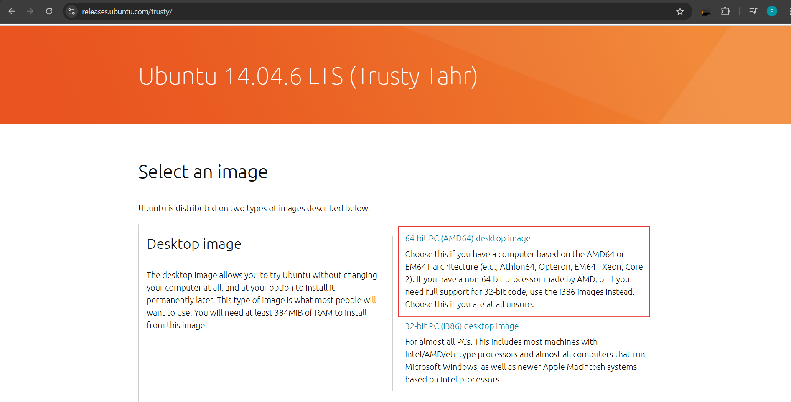
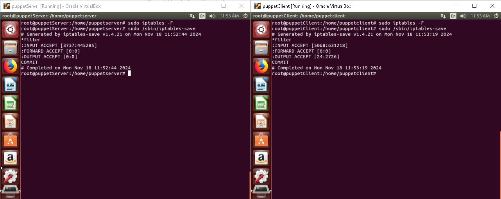
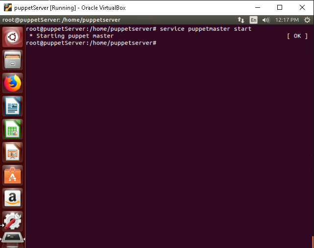

# **Puppet Master and Puppet Agent Installation and Configuration Guide**

## **Table of Contents**

1. [**Introduction**](#introduction)
2. [**Problem Statement**](#problem-statement)
3. [**Prerequisites**](#prerequisites)  
   - [**Software Requirements**](#software-requirements)  
   - [**Hardware Requirements**](#hardware-requirements)  
4. [**Implementation Steps**](#implementation-steps)  
   - [**Step 1: Download and Install Required Tools**](#step-1-download-and-install-required-tools)  
   - [**Step 2: Set Up Virtual Machines**](#step-2-set-up-virtual-machines)  
   - [**Step 3: Configure Networking**](#step-3-configure-networking)  
   - [**Step 4: Prepare the Machines**](#step-4-prepare-the-machines)  
   - [**Step 5: Install and Configure Puppet Packages**](#step-5-install-and-configure-puppet-packages)
   - [**Step 6: Install and Configure Puppet Master**](#step-6-install-and-configure-puppet-master)
   - [**Step 7: Install and Configure Puppet Agent**](#step-7-install-and-configure-puppet-agent)
   - [**Step 8: Establish Secure Communication Between Puppet Master and Agent**](#step-8-establish-secure-communication-between-puppet-master-and-agent)
5. [**References**](#references)

---

## **Introduction**

- Puppet is a configuration management tool that allows system administrators to automate the provisioning, configuration, and management of infrastructure. Puppet uses a client-server model where the Puppet Master server controls the configuration of Puppet Agent nodes.
- This guide provides a detailed step-by-step approach to installing and configuring Puppet Master and Puppet Agent in a lab environment. It assumes no prior knowledge of Puppet or infrastructure automation.

---

## **Problem Statement**

Puppet simplifies system management by enabling centralized configuration control across multiple systems. The objective is to set up a Puppet Master to manage configurations and a Puppet Agent to receive and apply those configurations.

---

## **Prerequisites**

### **Software Requirements**

- **Operating System:** Ubuntu Trusty Tahr 14.04 (ISO: [Download Here](https://releases.ubuntu.com/trusty/))
- **Virtual Machine Manager:** [Oracle VirtualBox](https://www.virtualbox.org/)

---

### **Hardware Requirements**

- **Processor:** 64-bit architecture.
- **RAM:** Minimum 4 GB.
- **Disk Space:** Minimum 50 GB.
- **Internet Connection:** Required for package installation and updates.

---

## **Implementation Steps**

### **Step 1: Download and Install Required Tools**

1. **Download Ubuntu ISO**:  

   - URL: [Ubuntu 14.04 ISO](https://releases.ubuntu.com/trusty/) download the desktop version.

   

   > *Purpose:* The ISO is used to install the operating system for both the Puppet Master and Puppet Agent.

2. **Install VirtualBox**:  

   - Download from [VirtualBox Official Site](https://www.virtualbox.org/).
   - Follow the [installation instructions](https://ultahost.com/knowledge-base/install-virtualbox-windows/) for your host operating system.  
   
   > *Purpose:* VirtualBox provides an isolated environment to create virtual machines.

---

### **Step 2: Set Up Virtual Machines**

1. **Create Virtual Machines in VirtualBox**: 

   - Open VirtualBox and click **New** to create two VMs:

     - **VM1:** Name it `puppetServer` (Master).
     - **VM2:** Name it `puppetClient` (Agent).

   

   - Assign 2 GB RAM, 20 GB disk space, and attach the Ubuntu ISO file for installation.  
   
   > *Purpose:* One VM will serve as the Puppet Master and the other as the Puppet Agent.

2. **Install Ubuntu on Each VM**:  

   2. **Install Ubuntu on Each VM**:  

      - Boot the VM with the ISO and follow the guided Ubuntu installation.  
      - For detailed installation instructions, refer to the [Ubuntu Installation Guide](https://ubuntu.com/tutorials/how-to-run-ubuntu-desktop-on-a-virtual-machine-using-virtualbox#1-overview).  
      - Set hostnames during setup:
      
        - VM1: `puppetServer`
        - VM2: `puppetClient`

---

### **Step 3: Configure Networking**

1. **Set Network Mode to Bridged Adapter**:  

   - In VirtualBox, go to **Settings > Network** for both VMs.
   - Change the adapter type to **Bridged Adapter**.
   - Start both VMs.  

   > *Purpose:* Ensures both VMs are on the same network and can communicate with each other.

2. **Verify Network Configuration**:  

   - Open a terminal in each VM and run:
     ```bash
     ifconfig -a
     ```

   

   > Note down the IP addresses of both machines.

---

### **Step 4: Prepare the Machines**

1. **Switch to Root User**: 

   - Gain superuser access by running the following command on both VMs:

     ```bash
     su
     ```

     

   > *Purpose:* Most of the configuration commands require root privileges.

2. **Disable Firewalls**:  

   - Run the following commands on both VMs:

     ```bash
     sudo iptables -F
     sudo /sbin/iptables-save
     ```

     

   > *Explanation:* Firewalls might block communication between the Puppet Master and Agent, so we disable them temporarily.

3. **Update Hostnames and Hosts File**:  

   - Edit the `/etc/hostname` file on each VM to set the hostname using editor of choice (e.g., `nano`):

     ```bash
     sudo nano /etc/hostname
     ```

   - Set the hostname to `puppetServer` for the Master and `puppetClient` for the Agent.

   

   - Edit the `/etc/hosts` file to add IP mappings for the hostnames on both VMs using editor of choice (e.g., `nano`):

     ```bash
     sudo nano /etc/hosts
     ```

     Add the following lines (replace `<IP-ADDRESS>` with the actual IPs) on puppetClient:

     ```
     <IP-ADDRESS>  puppetServer
     <IP-ADDRESS>  puppetClient
     ```

     Add the following lines (replace `<IP-ADDRESS>` with the actual IPs) on puppetServer:

     ```
     <IP-ADDRESS>  puppetServer
     ```

     

   > *Purpose:* The hosts file ensures that both machines can resolve each other's hostnames to IP addresses.

---

### **Step 5: Install and Configure Puppet Packages**

1. **Add Puppet Repository**:  

   Add the Puppet package repository for Ubuntu by running the following commands on both VMs:

   ```bash
   wget http://apt.puppetlabs.com/puppetlabs-release-trusty.deb
   ```

   

   Install the repository package using `dpkg`:

   ```bash
   sudo dpkg -i puppetlabs-release-trusty.deb
   ```

   

   Update the package list:

   ```bash
   sudo apt-get update
   ```

   

   > *Purpose:* Adds the Puppet package repository for Ubuntu.

### **Step 6: Install and Configure Puppet Master**

1. **Start NTP on Puppet Master**:

   Install the NTP package on `puppetServer`:

   ```bash
   apt-get -y install ntp
   ```

   

   Restart the NTP service:

   ```bash
   service ntp restart
   ```

   

   Check the NTP status:

   ```bash
   service ntp status
   ```

   

   > *Purpose:* Ensures that the system time is synchronized between the Puppet Master and Agent.

2. **Install Puppet Master**:  

   Install the Puppet Master package on `puppetServer`:

   ```bash
   sudo apt-get install puppetmaster
   ```

   

3. **Verify Installation**: 

   Check the Puppet version by running the following command on `puppetServer`:

   ```bash
   puppet --version
   ```

   

   > *Purpose:* Confirms that Puppet Master is installed successfully.

4. **Install the Puppet common with the following command**:

   ```bash
   sudo apt-get install puppet-common
   ```

   

5. **Lock Puppet Version**:

   To prevent Puppet from being upgraded during system updates, create a preferences file using the following command:

   ```bash
   sudo nano /etc/apt/preferences.d/00-puppet.pref
   ```

   Add the following configurations in the file (replace `3.8.7` with your Puppet version):

   ```
   # /etc/apt/preferences.d/00-puppet.pref
   Package: puppet puppet-common puppetmaster-passenger
   Pin: version 3.8.7*
   Pin-Priority: 501
   ```

   

   > *Purpose:* Ensures that the Puppet version remains consistent and prevents unexpected issues due to upgrades.

6. **Configure Puppet Master**:  

   - Edit the configuration file:

     ```bash
     sudo nano /etc/puppet/puppet.conf
     ```

     **Add:**

     ```
     [main]
     ssldir = /var/lib/puppet/ssl
     logdir = /var/log/puppet
     rundir = /var/run/puppet

     [master]
     certname = puppetServer
     ```

       

   > *Purpose:* Configures Puppet Master settings.

7. **Start Puppet Master Service**:  

   ```bash
   sudo service puppetmaster start
   ```

   

   > *Purpose:* Initiates the Puppet Master service.

---

### **Step 7: Install and Configure Puppet Agent**

1. **Install Puppet Agent**: 

   Install the Puppet Agent package on `puppetClient`:

   ```bash
   sudo apt-get install puppet
   ```

   

2. Puppet version can be checked by running the following command:

   ```bash
   puppet --version
   ```

   

   > *Purpose:* Confirms that Puppet Agent is installed successfully.

3. **Lock Puppet Version**

   To prevent Puppet from being upgraded during system updates, create a preferences file using the following command:

   ```bash
   sudo nano /etc/apt/preferences.d/00-puppet.pref
   ```

   Add the following configurations in the file (replace `3.8.7` with your Puppet version):

   ```
   # /etc/apt/preferences.d/00-puppet.pref
   Package: puppet puppet-common puppetmaster-passenger
   Pin: version 3.8.7*
   Pin-Priority: 501
   ```

   

   > *Purpose:* Ensures that the Puppet version remains consistent and prevents unexpected issues due to upgrades.

4. **Configure Puppet Agent**:  

   - Edit the Puppet configuration file:

     ```bash
     sudo nano /etc/puppet/puppet.conf
     ```

     Add:

     ```
     [main]
     ssldir = /var/lib/puppet/ssl
     vardir = /var/lib/puppet
     logdir = /var/log/puppet
     rundir = /var/run/puppet

     [agent]
     server = puppetserver
     ```

       

   > *Purpose:* Configures Puppet Agent settings.

3. **Start Puppet Agent Service**:  

   Edit the `/etc/default/puppet` file to enable the Puppet Agent service:

   ```bash
   sudo nano /etc/default/puppet
   ```

   Set `START=yes` in the file.

   

   Run the following command on `puppetClient`:

   ```bash
   service puppet start
   ```

   

---

### **Step 8: Establish Secure Communication Between Puppet Master and Agent**

1. **Start Puppet Master in No-Daemonize Mode**:

   On `puppetServer`, run the following command to create the CA certificate and a Puppet Master certificate:

   ```bash
   puppet master --no-daemonize --verbose
   ```

   

   > *Note:* Ignore the warning message and press `Ctrl+C` once you see the "Notice: Starting Puppet master version 5.4.0" message.

2. **Start and Enable Puppet Master Service**:

   Start the Puppet Master service:

   ```bash
   puppet resource service puppetmaster ensure=running
   ```

   

   Enable the Puppet Master service to start on boot:

   ```bash
   puppet resource service puppetmaster enable=true
   ```

   

3. **Send Certificate Signing Request from Puppet Agent**:

   On `puppetClient`, send the certificate signing request to the Puppet Master:

   ```bash
   puppet agent -t
   ```

   ```bash
   puppet agent --fingerprint
   ```

   

   > *Purpose:* Ensures that the Puppet Agent requests a certificate from the Puppet Master.

   4. **Sign the Certificate on Puppet Master**:

      On `puppetServer`, list the pending certificate requests:

      ```bash
      puppet cert list
      ```

      

      Sign the certificate requested by the Puppet Agent:

      ```bash
      puppet cert sign puppetclient.myguest.vrtualbox.org
      ```

      

      > *Purpose:* Approves the certificate request from the Puppet Agent, establishing trust.

   5. **Start and Enable Puppet Agent Service**:

      On `puppetClient`, start the Puppet Agent service:

      ```bash
      puppet resource service puppet ensure=running
      ```

      

      Enable the Puppet Agent service to start on boot:

      ```bash
      puppet resource service puppet enable=true
      ```

      

   6. **Verify Certificate Fingerprint**:

      On `puppetClient`, verify the fingerprint of the certificate:

      ```bash
      puppet agent --fingerprint
      ```

      

      > *Purpose:* Confirms that the Puppet Agent has a valid certificate signed by the Puppet Master.

   Now, there is a secure connection between the Puppet Master and the Puppet Agent.

---

## **References**

- [Puppet Installation Guide](https://www.javatpoint.com/puppet-installation)
- [Oracle VirtualBox](https://www.virtualbox.org/)
- [Ubuntu Trusty Tahr 14.04](https://releases.ubuntu.com/trusty/)

---