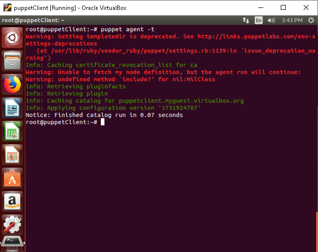
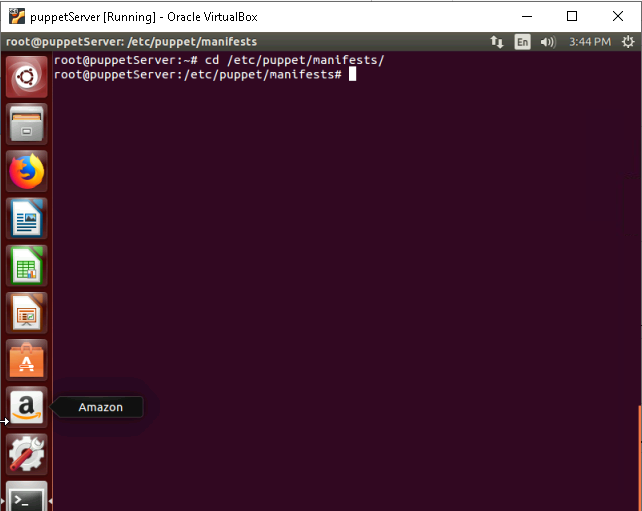
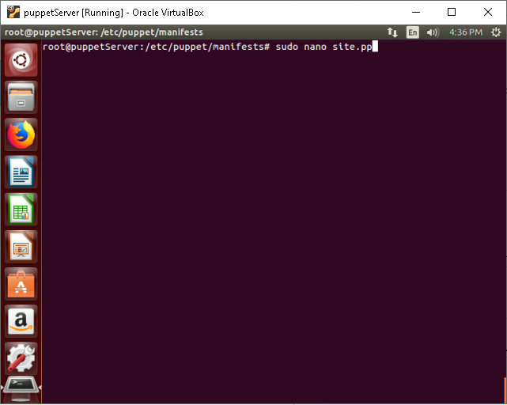
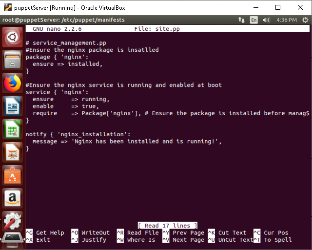
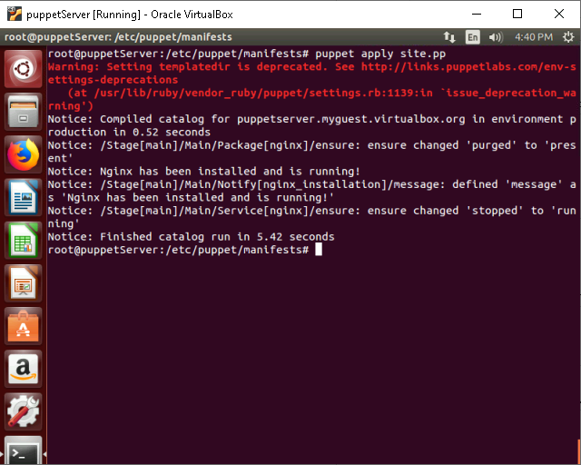
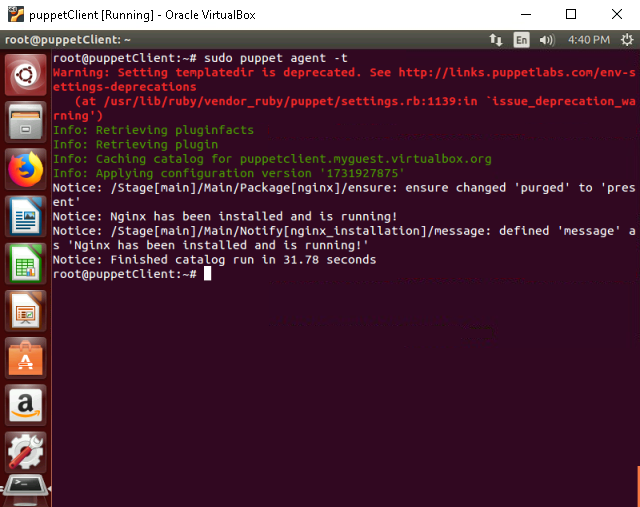
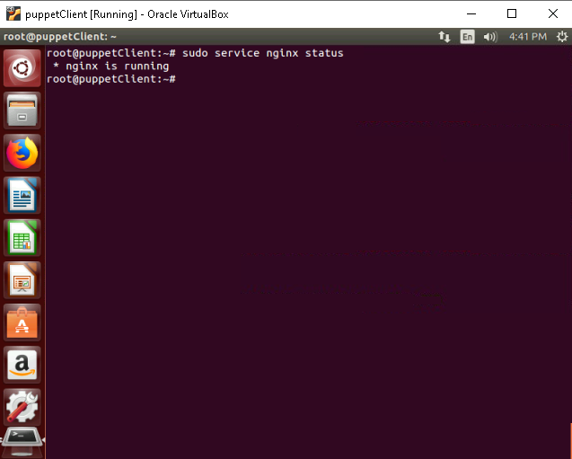

# **Write and apply a basic Puppet manifest to manage a service on a node**

## **Table of Contents**

1. [**Introduction**](#introduction)  
2. [**Problem Statement**](#problem-statement) 
3. [**Prerequisites**](#prerequisites)  
   - [**Software Requirements**](#software-requirements)  
   - [**Hardware Requirements**](#hardware-requirements)   
4. [**Implementation Steps**](#implementation-steps)  
   - [**Step 1: Verify Communication Between Puppet Master and Agent**](#step-1-verify-communication-between-puppet-master-and-agent)  
   - [**Step 2: Create the Puppet Manifest**](#step-2-create-the-puppet-manifest)  
   - [**Step 3: Apply the Manifest**](#step-3-apply-the-manifest)  
   - [**Step 4: Configure Puppet Agent to Apply the Manifest**](#step-4-configure-puppet-agent-to-apply-the-manifest)  
   - [**Step 5: Verify the Configuration**](#step-5-verify-the-configuration)  
5. [**References**](#references)

---

## **Introduction**

In this guide, we will walk through the steps of writing and applying a basic Puppet manifest to manage a service (e.g., `nginx`) on a node. Puppet automates the process of managing software packages and services across a fleet of machines, and this tutorial will show you how to use Puppet to ensure that a service is installed, running, and enabled to start at boot.

---

## **Problem Statement**

Many systems administrators face the challenge of manually installing and managing services across multiple nodes. This guide provides a solution by using Puppet to automate the process of managing services on a node, ensuring consistency and reducing the potential for human error.

---

## **Prerequisites**
Completion of all previous lab guides (up to Lab Guide-01) is required before proceeding with Lab Guide-02.

---

### **Software Requirements**

- Puppet Master installed and configured.
- Puppet Agent installed on the target node.
- A machine with Ubuntu (or any Linux distribution) for both Puppet Master and Agent.
- `nginx` service package available for installation.

---

### **Hardware Requirements**

- A minimum of 2 machines or virtual machines (VMs) for the Puppet Master and Agent.
- Network connection between Puppet Master and Puppet Agent.

---

## **Implementation Steps**

### **Step 1: Verify Communication Between Puppet Master and Agent**

Before applying any manifest, ensure that the Puppet Master and Agent can communicate without issues.

- **On the Puppet Agent node**, run the following command:

  ```bash
  puppet agent -t
  ```

    

  > *Explanation*: This command tells the Puppet Agent to connect to the Puppet Master and check for any configuration changes. It should output success if the communication is working correctly.

---

### **Step 2: Create the Puppet Manifest**

Now, we'll write a Puppet manifest to install and manage the `nginx` service.

1. **On the Puppet Master**, navigate to the Puppet manifest directory:

   ```bash
   cd /etc/puppet/manifests
   ```

    

   - *Explanation*: This is where all the Puppet manifests are stored, and we will create our new manifest in this directory.

2. **Create a new file** called `site.pp`:

   ```bash
   sudo nano site.pp
   ```

    

3. **Write the manifest to install and manage `nginx`**:

   ```puppet
   # service_management.pp

   # Ensure nginx is installed
   package { 'nginx':
     ensure => installed,
   }

   # Ensure nginx service is running and enabled at boot
   service { 'nginx':
     ensure     => running,
     enable     => true,
     require    => Package['nginx'], # Make sure the package is installed first
   }

   notify { 'nginx_installation':
     message => 'Nginx has been installed and is running!',
   }
   ```

   - *Explanation*: 
     - The `package` resource ensures that the `nginx` package is installed on the target node.
     - The `service` resource ensures that the `nginx` service is running and enabled at boot. The `require` statement ensures that the package is installed before the service is started.

    

4. Save and exit the editor.

---

### **Step 3: Apply the Manifest**

1. **Test the manifest on the Puppet Master**:

   ```bash
   puppet apply site.pp
   ```

    

   - *Explanation*: This command applies the manifest locally on the Puppet Master to check if there are any errors before deploying it to the Puppet Agent.

---

### **Step 4: Configure Puppet Agent to Apply the Manifest**

After testing the manifest locally, now we need to make sure that the Puppet Agent receives and applies the manifest.

1. **Trigger the Puppet Agent** to apply the configuration:

   ```bash
   puppet agent -t
   ```

    

   - *Explanation*: This command initiates the Puppet Agent, which will connect to the Puppet Master and apply the manifest defined by the Master.

---

### **Step 5: Verify the Configuration**

After applying the manifest, it's important to verify that the `nginx` service is installed and running correctly on the Puppet Agent.

1. **Check the status of the `nginx` service**:

   ```bash
   sudo service nginx status
   ```
   - *Explanation*: This command checks whether the `nginx` service is running on the Agent node. The service should be active and running.
    
    
---

## **References**

- [Manifests Documentation](https://www.digitalocean.com/community/tutorials/getting-started-with-puppet-code-manifests-and-modules)

---