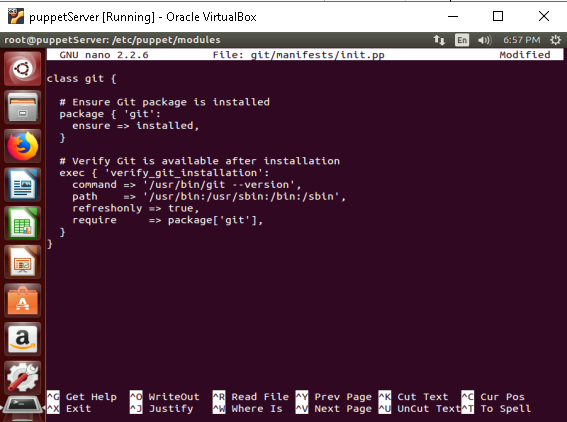

# **Use Puppet modules to manage resources across multiple nodes**

## **Table of Contents**

1. [**Introduction**](#introduction)
2. [**Problem Statement**](#problem-statement)
3. [**Prerequisites**](#prerequisites)  
   - [**Software Requirements**](#software-requirements)  
   - [**Hardware Requirements**](#hardware-requirements)   
4. [**Implementation Steps**](#implementation-steps)
    - [**1. Navigate to the Modules Directory**](#1-navigate-to-the-modules-directory)
    - [**2. Create a Module Structure**](#2-create-a-module-structure)
    - [**3. Create the Manifest File**](#3-create-the-manifest-file)
    - [**4. Add the Module to Site Manifest**](#4-add-the-module-to-site-manifest)
    - [**5. Use the Module to Manage Resources**](#5-use-the-module-to-manage-resources)
    - [**6. Apply the Configuration on the Agent Node**](#6-apply-the-configuration-on-the-agent-node)
    - [**7. Verify Git Installation**](#7-verify-git-installation)
5. [**References**](#references)

---

## **Introduction**

Puppet modules are collections of manifests, files, templates, and other Puppet code that provide reusable, modular configurations for managing different resources. A module allows system administrators to define configurations for one or more resources that can be applied to multiple nodes with minimal effort. This guide will walk you through using Puppet modules to manage resources across multiple nodes.

---

## **Problem Statement**

Managing configurations manually across a large number of nodes is error-prone and time-consuming. Puppet modules provide an efficient and scalable way to apply configurations to multiple nodes, ensuring consistency and minimizing human intervention. The challenge is to create reusable modules that can be easily maintained and applied to different nodes.

---

## **Prerequisites**
Completion of all previous lab guides (up to Lab Guide-02) is required before proceeding with Lab Guide-03.

---

### **Software Requirements**

- Puppet Master installed and configured.
- Puppet Agent installed on target nodes.
- Ubuntu (or any Linux distribution) for both Puppet Master and Puppet Agent nodes.
- Puppet Modules installed (can be custom or community modules).

---

### **Hardware Requirements**

- A minimum of 2 machines or virtual machines (VMs) for Puppet Master and Agent.
  - Puppet Master machine: Minimum 1GB RAM, 2 CPUs, and 20GB Disk.
  - Puppet Agent machine: Minimum 512MB RAM, 1 CPU, and 10GB Disk.
- Network connection between Puppet Master and Puppet Agent nodes.

---

## **Implementation Steps**

In this guide, we will create a Puppet module to manage the Git package on multiple nodes. The module will ensure that the Git package is installed on all nodes and verify the installation by running the `git --version` command.

### **1. Navigate to the Modules Directory**

Move to Puppet's default module path on the **Puppet Master**:

```bash
cd /etc/puppet/modules
```

---

### **2. Create a Module Structure**

Generate the necessary structure for the `git` module:

```bash
mkdir -p git/{manifests,files,templates}
```


---

### **3. Create the Manifest File**

Edit the `init.pp` file in the `manifests` directory:

```bash
sudo nano /etc/puppet/modules/Git/manifests/init.pp
```



Add the following code:

```puppet
class git {

  # Ensure Git package is installed
  package { 'git':
    ensure => installed,
  }

  # Verify Git is available after installation
  exec { 'verify_git_installation':
    command     => '/usr/bin/git --version',
    path        => '/usr/bin:/usr/sbin:/bin:/sbin',
    refreshonly => true,
    require     => Package['git'],
  }
}
```


**Explanation**:
- The `git` class ensures the `git` package is installed on the node.
- The `package` resource ensures the `git` package is installed.
- The `exec` resource verifies the Git installation by running the `git --version` command.
  - The `path` parameter specifies the directories to search for the `git` binary.
  - The `refreshonly` parameter ensures the command is only executed when the `git` package is installed.
  - The `require` parameter specifies that the `exec` resource depends on the `git` package.
---

### **4. Add the Module to Site Manifest**

Open the **site manifest** on the Puppet Master:

```bash
sudo nano /etc/puppet/manifests/site.pp
```


Include the `Git` class for the desired nodes:

```puppet
node default {
  include Git
}
```

---

### **5. Use the Module to Manage Resources** 

Once the module is created, we can apply it on the Puppet Agent nodes to manage the git package and service.

On the Puppet Master, ensure the module is properly loaded by checking the module path:

```bash
puppet module list
```


> Explanation: This command lists all available modules on the Puppet Master. Your nginx module should appear in this list.


### **6. Apply the Configuration on the Agent Node**

Run the Puppet agent on the **agent node( `puppetClient` )** to fetch and apply the configuration:

```bash
puppet agent -t
```


---

### **7. Verify Git Installation**

1. **Check if Git is installed**:

   ```bash
   git --version
   ```

    

---

## **References**

- [Getting Started with Puppet: Code Manifests and Modules](https://www.digitalocean.com/community/tutorials/getting-started-with-puppet-code-manifests-and-modules)

---