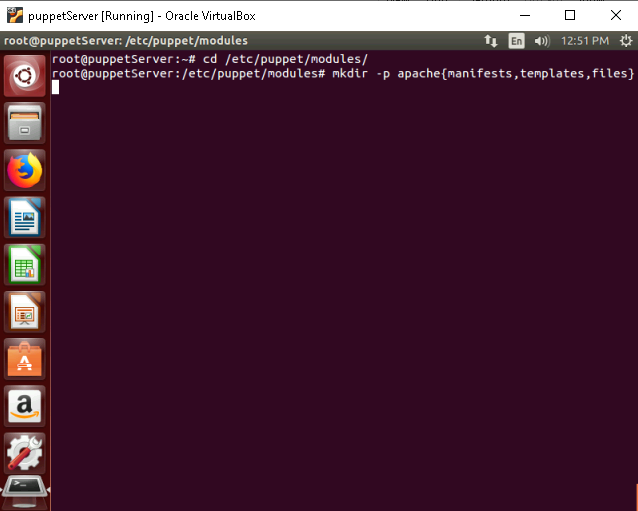
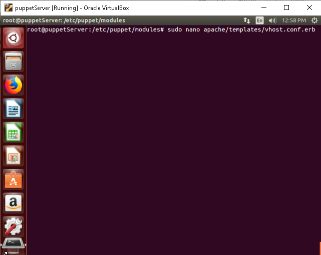

# **Implement Hiera to manage configuration data hierarchically.**

## **Table of Contents**

1. [**Introduction**](#introduction)
2. [**Problem Statement**](#problem-statement)
3. [**Pre-requisites**](#pre-requisites)
4. [**Steps to Implement Hiera**](#steps-to-implement-hiera)
    - [**1. Install Hiera (if not already installed)**](#1-install-hiera-if-not-already-installed)
    - [**2. Configure Hiera**](#2-configure-hiera)
    - [**3. Create Hierarchical Data Files**](#3-create-hierarchical-data-files)
    - [**4. Create a Puppet Module**](#4-create-a-puppet-module)
    - [**5. Apply the Module**](#5-apply-the-module)
5. [**References**](#references)

---

## **Introduction**

This guide provides a step-by-step approach to implementing Hiera for managing configuration data hierarchically in Puppet.

---

## **Problem Statement**

Managing configuration data directly within Puppet manifests can lead to duplication and reduced maintainability. Hiera helps to separate configuration data from code, making it easier to manage and reuse.
  
---

## **Pre-requisites**  

Completion of all previous lab guides (up to Lab Guide-03) is required before proceeding with Lab Guide-04.

1. Puppet 3.8.7 is installed on your Puppet Master and Agent nodes.  
2. Ensure YAML support is available, as it's the default backend for Hiera.  
3. Administrative access to configure files on the Puppet server.  

---

## **Steps to Implement Hiera**  

### **1. Install Hiera (if not already installed)**  

Hiera is bundled with Puppet 3.8.7. Verify installation using:  

```bash  
puppet --version  
hiera --version  
```  


If not installed, run:  

```bash  
sudo apt-get install hiera  
```  

---

### **2. Configure Hiera**  

1. **Create the Hiera Configuration File**  

   The `hiera.yaml` file should be located at `/etc/puppet/hiera.yaml`. Example configuration:  

   ```yaml
   sudo nano /etc/puppet/hiera.yaml
   ```

   

   ```yaml  
   :backends:  
     - yaml  
   :yaml:  
     :datadir: /etc/puppet/hieradata  
   :hierarchy:  
     - "node/%{::fqdn}"  
     - "environment/%{::env}/main"  
     - "environment/%{::env}/%{calling_module}"  
     - defaults  
   ```  

   

   - **Backends**: Defines data storage formats (YAML is default).  
   - **Data Directory**: `/etc/puppet/hieradata` is where your YAML files will reside.  
   - **Hierarchy**: Defines the order of data lookups. It uses variables like `::fqdn` (node hostname) or `::env` (environment).  

2. **Create Data Directory**  

   Ensure the directory `/etc/puppet/hieradata` exists: 

   ```bash  
   sudo mkdir -p /etc/puppet/hieradata/{node,environment}  
   sudo chmod -R 750 /etc/puppet/hieradata  
   ```  

   

    - **Node Data**: Contains node-specific data files.
    - **Environment Data**: Contains environment-specific data files.

---

### **3. Create Hierarchical Data Files**  

1. **Common Data**: Default values shared across nodes.

   File: `/etc/puppet/hieradata/defaults.yaml`  
    
   ```bash
   sudo nano /etc/puppet/hieradata/defaults.yaml  
   ```
   
       

   Example:  

   ```yaml  
   apache::port: 80  
   apache::docroot: "/var/www/html"  
   ```  

   


2. **Node-Specific Data**: Values for individual nodes.

   File: `/etc/puppet/hieradata/node/puppetclient.myguest.virtualbox.org.yaml`  

    ```bash
    sudo nano /etc/puppet/hieradata/node/puppetclient.myguest.virtualbox.org.yaml  
    ```

    

   Example:  

   ```yaml  
   apache::port: 80 
   apache::docroot: "/home/www/html"  
   ``` 

    

3. **Environment-Specific Data**: Values for environments like `dev` or `prod`, environments has to be created in `/etc/puppet/hieradata/environment/` directory manually.

   File: `/etc/puppet/hieradata/environment/prod/main.yaml`  

    ```bash
    sudo nano /etc/puppet/hieradata/environment/prod/main.yaml  
    ```

    

   Example:  

   ```yaml  
   apache::port: 80  
   ```  

    

---

### **4. Create a Puppet Module**  

Modules are essential for organizing Puppet manifests and enabling Hiera integration.  

#### Step 1: Create the Module Directory  

```bash  
cd /etc/puppet/modules  
mkdir -p apache{manifests,templates,files}
```  



This creates a skeleton module structure:  

```  
modules/apache/  
├── manifests/  
├── templates/  
├── files/  
```  


#### Step 2: Define a Manifest  

Create a manifest to define your class in `manifests/init.pp`:  

```bash
sudo nano apache/manifests/init.pp
```


```puppet  
class apache (  
  $port    = hiera('apache::port', 80),  
  $docroot = hiera('apache::docroot', '/var/www/html'),  
) {  
  package { 'apache2':  
    ensure => installed,  
  }  

  service { 'apache2':  
    ensure     => running,  
    enable     => true,  
    require    => Package['apache2'],  
  }  

  file { '/etc/apache2/sites-enabled':
    ensure => directory,
    owner  => 'root',
    group  => 'root',
    mode   => '0755',
  }

  file { '/etc/apache2/sites-enabled/000-default.conf':
    ensure  => file,
    content => template('apache/vhost.conf.erb'),
    notify  => Service['apache2'],
    require => File['/etc/apache2/sites-enabled'],  # Ensure the directory exists first
  }  
}  
```  


#### Step 3: Add a Template  

Create a file `templates/vhost.conf.erb` for the virtual host configuration: 

```bash
sudo nano apache/templates/vhost.conf.erb
```



```erb  
<VirtualHost *:<%= @port %>>  
  DocumentRoot <%= @docroot %>  
  <Directory <%= @docroot %>>  
    Options Indexes FollowSymLinks  
    AllowOverride None  
    Require all granted  
  </Directory>  
</VirtualHost>  
```  


---

### **5. Apply the Module**  

1. Include the module in a node manifest:  
 
   ```bash
   sudo nano /etc/puppet/manifests/site.pp
   ```

   

   ```puppet  
   node 'puppetclient.myguest.virtualbox.org' {  
     include apache  
   }  
   ```  

    

2. Run Puppet to apply the changes:  

   ```bash  
   puppet agent --test  
   ```  

    

3. Verify the Apache service is running:

    ```bash  
    sudo service apache2 status  
    ```  
  
      

4. Check the virtual host configuration file:   

    ```bash  
    cat /etc/apache2/sites-enabled/000-default.conf  
    ```  

    

5. Test the Apache server by browsing to `http://puppetclient.myguest.virtualbox.org` in a web browser.

    

---

## **References**  

- [Puppet Hiera Documentation](https://puppet.com/docs/puppet/3.8/hiera.html)  
- [Linux Journal: Using Hiera with Puppet](https://www.linuxjournal.com/content/using-hiera-puppet)  

---