# **Use Puppet's file server to distribute files to multiple nodes**


## **Table of Contents**

1. [**Introduction**](#introduction)  
2. [**Problem Statement**](#problem-statement)  
3. [**Prerequisites**](#prerequisites)  
   - [**Software Requirements**](#software-requirements)  
   - [**Hardware Requirements**](#hardware-requirements)    
4. [**Implementation Steps**](#implementation-steps)  
   - [**Step 1: Configure Puppet File Server**](#step-1-configure-puppet-file-server)  
   - [**Step 2: Place Files on Puppet Master**](#step-2-place-files-on-puppet-master)  
   - [**Step 3: Write a Puppet Manifest to Distribute Files**](#step-3-write-a-puppet-manifest-to-distribute-files)  
   - [**Step 4: Apply the Configuration**](#step-4-apply-the-configuration)  
   - [**Step 5: Verify File Distribution**](#step-5-verify-file-distribution)  
5. [**References**](#references)  

---

## **Introduction**

Puppet’s file server allows administrators to store and distribute files from the Puppet Master to multiple nodes. This simplifies the process of ensuring specific files or configurations are present and consistent across all managed nodes.

---

## **Problem Statement**

Manually copying files to multiple nodes is time-consuming and error-prone. Using Puppet’s file server, administrators can centralize file storage on the Puppet Master and automate the distribution of these files to Puppet Agents.

---

## **Prerequisites**
Completion of all previous lab guides (up to Lab Guide-04) is required before proceeding with Lab Guide-05.

---

### **Software Requirements**

- Puppet 3.8.7
- Puppet Master and Agent properly configured
- Files to be distributed (e.g., configuration files, scripts)

---

### **Hardware Requirements**

- Puppet Master: 1GB RAM, 2 CPUs, 10GB Disk
- Puppet Agent: 512MB RAM, 1 CPU, 5GB Disk

---

## **Implementation Steps**

### **Step 1: Configure Puppet File Server**

1. **Locate the `fileserver.conf` File**:

   The configuration file is typically located at `/etc/puppet/fileserver.conf`.

   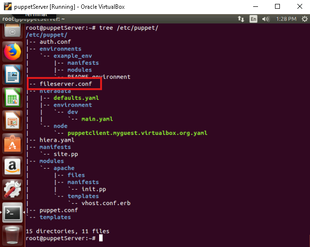

2. **Define a File Mount Point**:

   Open the file and configure a mount point for your files:

   ```bash
   sudo nano /etc/puppet/fileserver.conf
   ```
   
   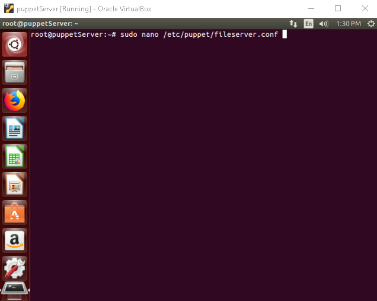

   Add the following:

   ```
   [files]
   path /etc/puppet/files
   allow *
   ```

   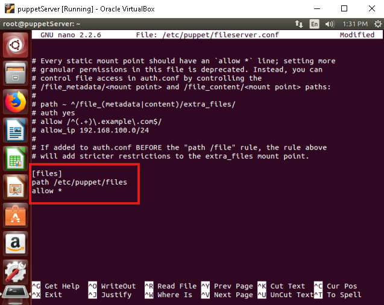

   - **Explanation**:
     - `[files]`: The mount point name.
     - `path`: Directory where files to be distributed are stored.
     - `allow *`: Allows all nodes to access this mount point.

3. **Restart the Puppet Server**:

   After making changes, restart the Puppet Server to apply them:

   ```bash
   sudo service puppetmaster restart
   ```

   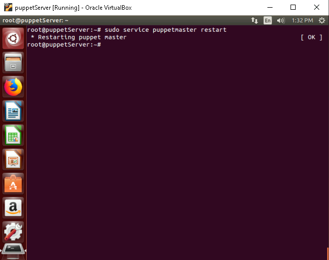

    - **Explanation**: The Puppet Server reloads the configuration files, including the file server configuration.

---

### **Step 2: Place Files on Puppet Master**

1. **Create the Directory for Files**:

   Ensure the directory specified in `fileserver.conf` exists:

   ```bash
   sudo mkdir -p /etc/puppet/files
   ```

   

2. **Create Files to Distribute and Copy to Puppet Master file Directory**:

   **Create the files:**

   file1.txt:

   ```bash
   sudo nano file1.txt
   ```

   

   Add the following content:

   ```plaintext
    This is file1.txt
   ```

   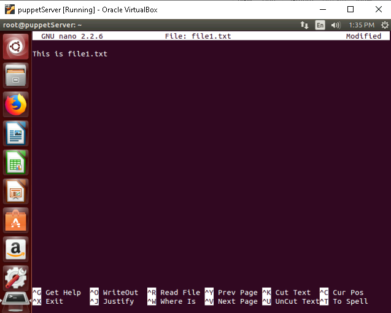

    file2.conf: 

    ```bash
    sudo nano file2.conf
    ```

    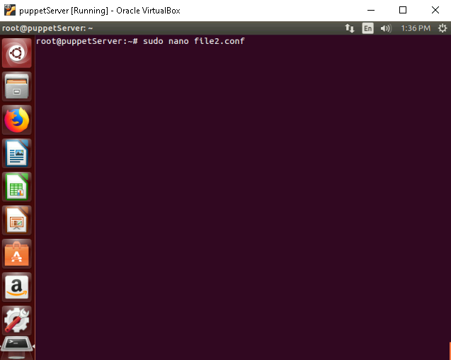

    Add the following content:

    ```plaintext
    # This is file2.conf
    ```

    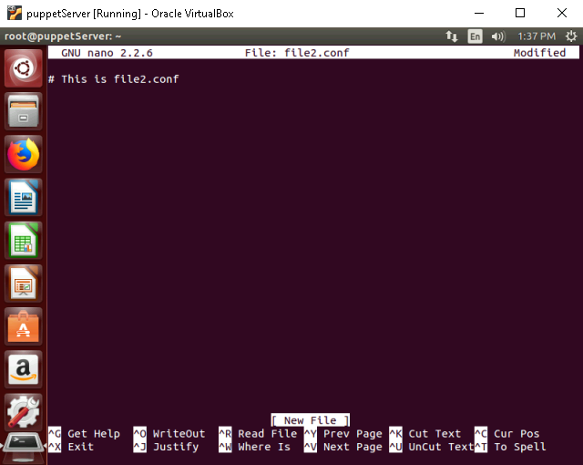

    **Copy the files to the Puppet Master file directory:**

   ```bash
   sudo cp file1.txt /etc/puppet/files/
   sudo cp file2.conf /etc/puppet/files/
   ```

    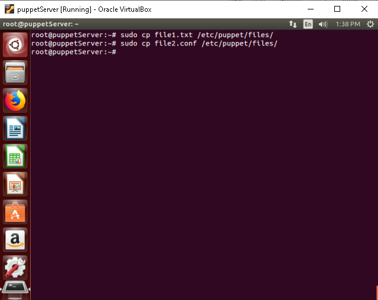

    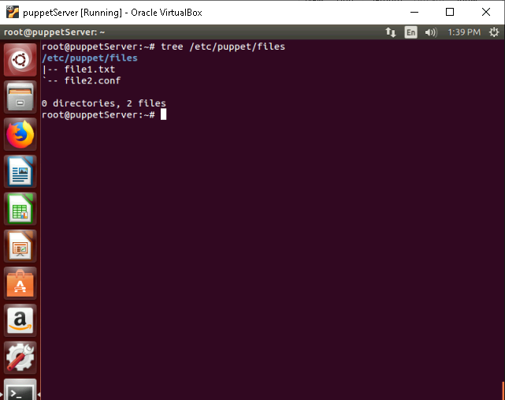

3. **Set Permissions**:

   Ensure the files and directories are readable by the Puppet user:

   ```bash
   sudo chown -R puppet:puppet /etc/puppet/files
   sudo chmod -R 644 /etc/puppet/files
   ```

   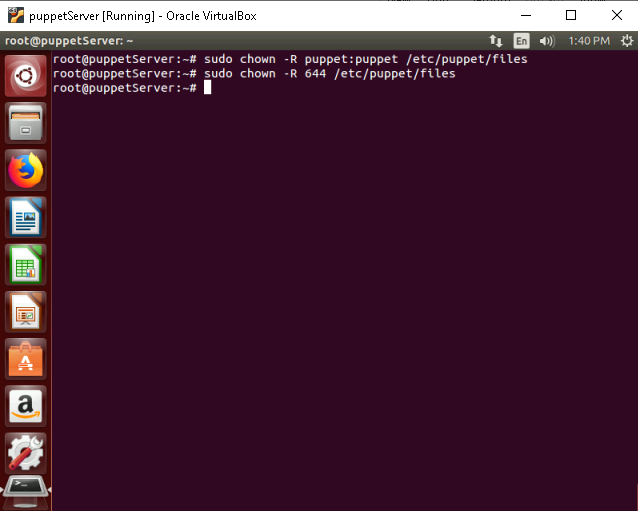

---

### **Step 3: Write a Puppet Manifest to Distribute Files**

1. **Create or Edit the Manifest File**:

   Create a new manifest file or modify an existing one:

   ```bash
   sudo nano /etc/puppet/manifests/site.pp
   ```

    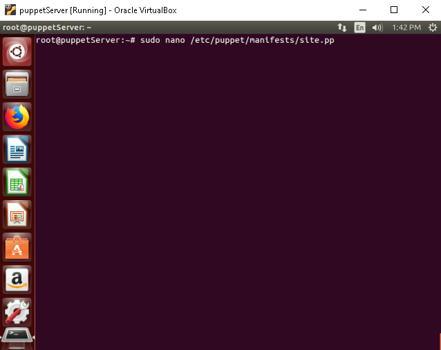

2. **Add a File Resource**:
   Use the `file` resource to manage the distribution of files:

   ```puppet
   node 'puppetclient.myguest.virtualbox.org' {
     file { '/etc/custom':
       ensure => directory,
     }

     file { '/tmp/file1.txt':
       ensure => file,
       source => 'puppet:///files/file1.txt', 
     }

     file { '/etc/custom/file2.conf':
       ensure => file,
       source => 'puppet:///files/file2.conf',
     }
   }
   ```

    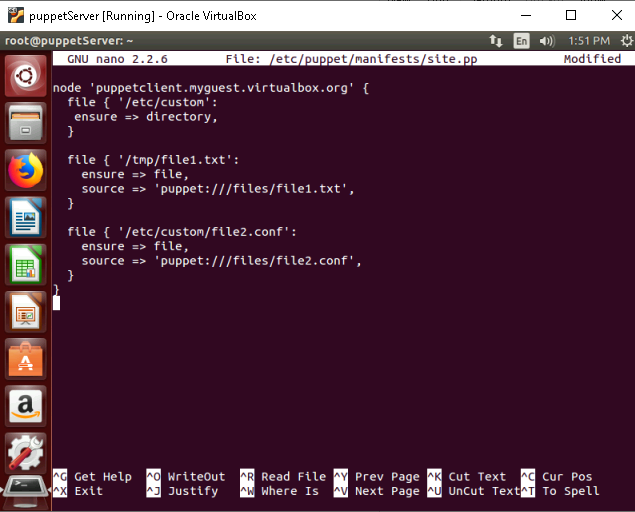

   - **Explanation**:
     - `ensure`: Ensures the file exists.
     - `source`: Specifies the file’s location on the Puppet Master using the `puppet:///` URI.

---

### **Step 4: Apply the Configuration**

1. **Trigger Puppet Agent Run**:

   On the Puppet Agent node, run:

   ```bash
   puppet agent -t
   ```

    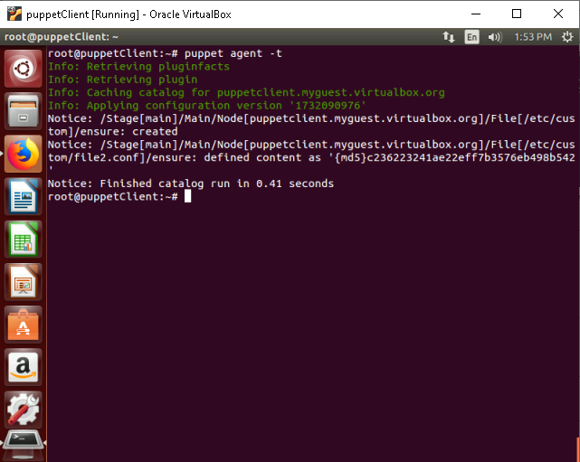

   - **Explanation**: The agent fetches the catalog from the Puppet Master and applies the configuration, including downloading the specified files.

---

### **Step 5: Verify File Distribution**

1. **Check Files on the Agent**:

   Verify that the files are distributed to the correct locations:
   ```bash
   ls -l /tmp/file1.txt
   ls -l /etc/custom/file2.conf
   ```

    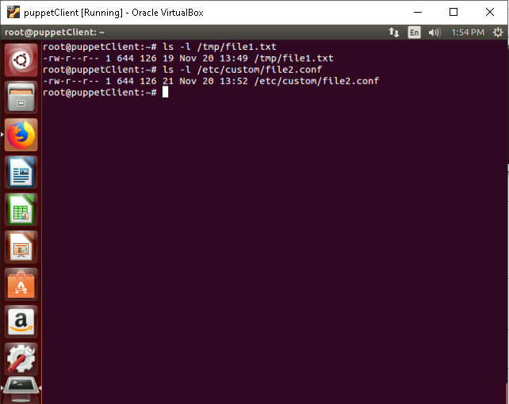

2. **Compare File Contents**:

   Confirm the file contents match the originals:

   ```bash
   cat /tmp/file1.txt
   cat /etc/custom/file2.conf
   ```

    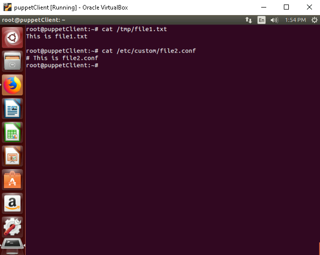

---

## **References**

- [Puppet File Server](https://www.tutorialspoint.com/puppet/puppet_file_server.htm)
- [Puppet File Server-2](https://www.javatpoint.com/puppet-file-server)

---