# **Create and manage Puppet environments to handle different configurations**

## **Table of Contents**

1. [**Introduction**](#introduction)  
2. [**Problem Statement**](#problem-statement)  
3. [**Prerequisites**](#prerequisites)  
   - [**Software Requirements**](#software-requirements)  
   - [**Hardware Requirements**](#hardware-requirements)   
4. [**Implementation Steps**](#implementation-steps)  
   - [**Step 1: Set Up Puppet Environment Directory Structure**](#step-1-set-up-puppet-environment-directory-structure)  
   - [**Step 2: Configure Puppet to Use Environments**](#step-2-configure-puppet-to-use-environments)  
   - [**Step 3: Create Environment-Specific Manifests**](#step-3-create-environment-specific-manifests)  
   - [**Step 4: Apply Environments to Nodes**](#step-4-apply-environments-to-nodes)  
   - [**Step 5: Manage Environments in Puppet**](#step-5-manage-environments-in-puppet)  
5. [**References**](#references)

---

## **Introduction**

Puppet environments are a powerful way to manage different configurations across multiple nodes. For example, you might want to apply different configurations for development, staging, and production environments. By using environments, you can manage these configurations separately without conflicts.

---

## **Problem Statement**

Managing different configurations for multiple stages (like development, testing, and production) within a single Puppet setup can be error-prone and difficult to maintain. Puppet environments allow for clean separation of configuration code based on the target environment.

---

## **Prerequisites**
Completion of all previous lab guides (up to Lab Guide-05) is required before proceeding with Lab Guide-06.

---

## **Software Requirements**

- Puppet 3.8.7
- Puppet Master and Agent properly installed
- A file system that supports multiple directories for different environments

---

## **Hardware Requirements**

- Puppet Master: Minimum 1GB RAM, 2 CPUs, 10GB Disk
- Puppet Agent: Minimum 512MB RAM, 1 CPU, 5GB Disk

---

## **Implementation Steps**

### **Step 1: Set Up Puppet Environment Directory Structure**

1. **Create a Directory for Environments**:

   The Puppet Master needs a dedicated directory for environments, where each environment can have its own configuration (manifests, modules, etc.). By default, this directory is `/etc/puppet/environments/`.

   To create and set up environments:

   ```bash
   sudo mkdir -p /etc/puppet/environments/{production,development,staging}
   ```

   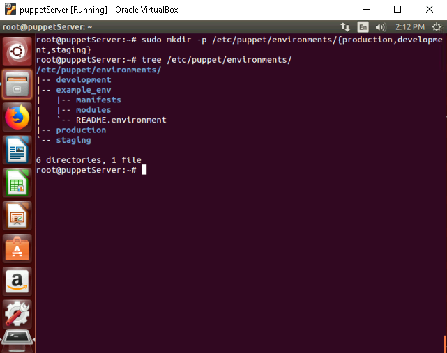

2. **Directory Structure**:

   Inside each environment, you can create subdirectories for `modules`, `manifests`, and other necessary files. For example:

   ```bash
   sudo mkdir -p /etc/puppet/environments/production/{manifests,modules}
   sudo mkdir -p /etc/puppet/environments/development/{manifests,modules}
   sudo mkdir -p /etc/puppet/environments/staging/{manifests,modules}
   ```

    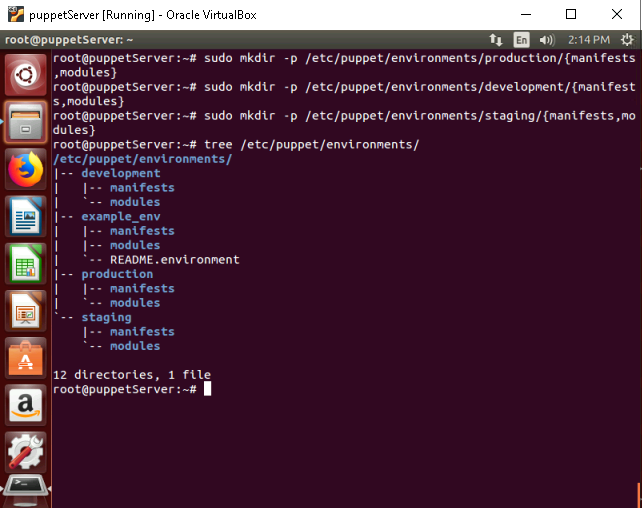

   Each environment will have its own set of `manifests` and `modules` that are isolated from one another.

---

### **Step 2: Configure Puppet to Use Environments**

1. **Edit Puppet Configuration**:

   Open the `puppet.conf` file located at `/etc/puppet/puppet.conf`:

   ```bash
   sudo nano /etc/puppet/puppet.conf
   ```

   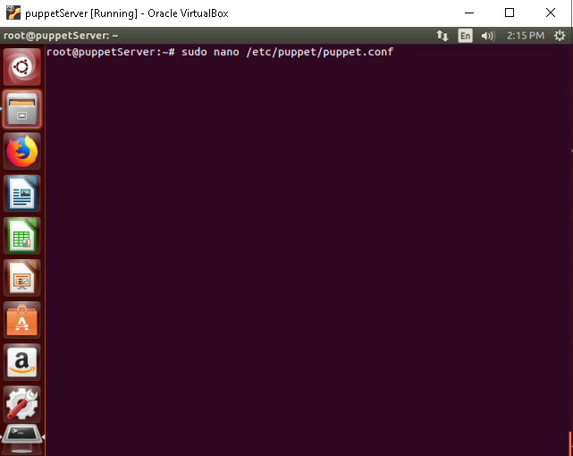

2. **Set the Environment Path**:

   Add or modify the following lines to enable environment support:

   ```ini
   [main]
   environmentpath = /etc/puppet/environments
   ```

   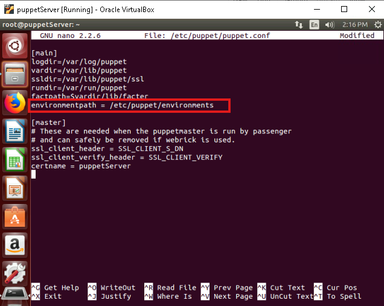

   - **Explanation**: This configuration tells Puppet to look in `/etc/puppet/environments/` for environments.

3. **Restart the Puppet Master**:

   After configuring Puppet to use environments, restart the Puppet Master to apply the changes:

   ```bash
   sudo service puppetmaster restart
   ```

    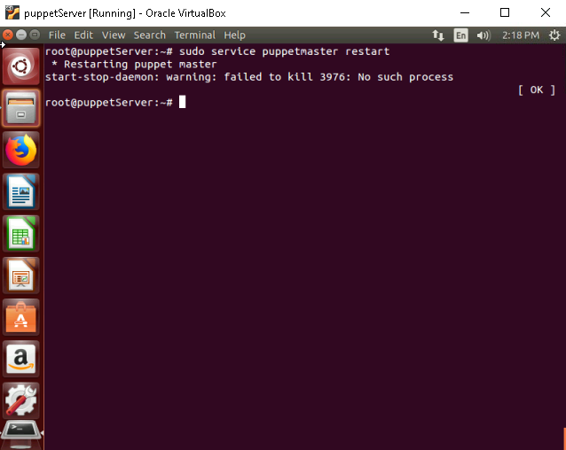

---

### **Step 3: Create Environment-Specific Manifests**

1. **Create an Environment-Specific Manifest**:

   Each environment will have its own manifest. For example, create a `site.pp` file for each environment:
   
   - **For the `production` environment**:

     ```bash
     sudo nano /etc/puppet/environments/production/manifests/site.pp
     ```

     

     Add configurations specific to the production environment:

     ```puppet
     node 'puppetclient.myguest.virtualbox.org' {
       include production
     }

     class production {
       # Define production-specific configurations
       package { 'nginx':
         ensure => installed,
       }
     }
     ```

     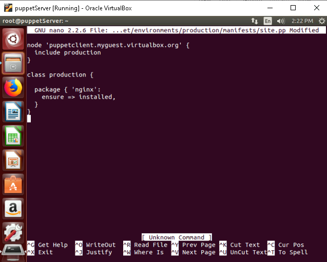

   - **For the `development` environment**:

     ```bash
     sudo nano /etc/puppet/environments/development/manifests/site.pp
     ```

     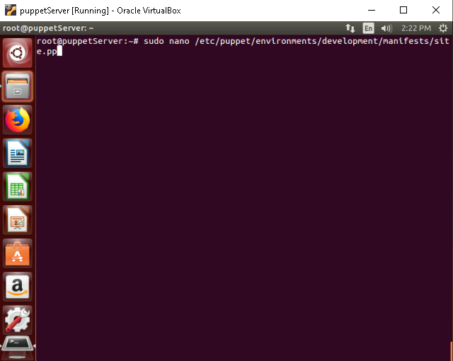

     Add configurations specific to the development environment:

     ```puppet
     node default {
       include development
     }

     class development {
       # Define development-specific configurations
       package { 'apache2':
         ensure => installed,
       }
     }
     ```

     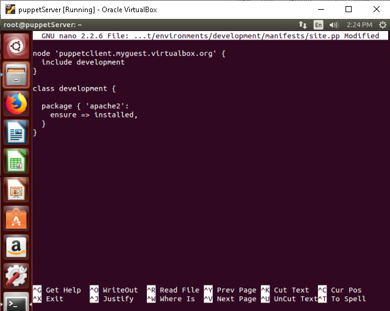

2. **Create Additional Modules (Optional)**:

   You can also create environment-specific modules within the `modules` directory inside each environment:

   ```bash
   sudo mkdir -p /etc/puppet/environments/production/modules/nginx
   sudo mkdir -p /etc/puppet/environments/development/modules/apache
   ```

---

### **Step 4: Apply Environments to Nodes**

1. **Assign Environments to Nodes**:

   Assign specific environments to Puppet Agent nodes using the `puppet.conf` file or through external node classification (ENC). For example, modify the `puppet.conf` on the agent:

   ```bash 
   sudo nano /etc/puppet/puppet.conf
   ``` 

   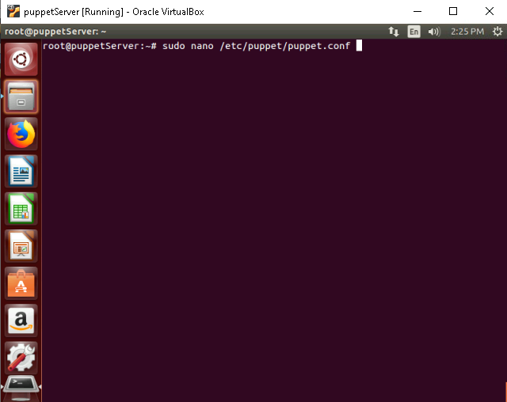
 
    Add the following lines to assign an environment to the agent:

   ```ini
   [agent]
   environment = production
   ```

   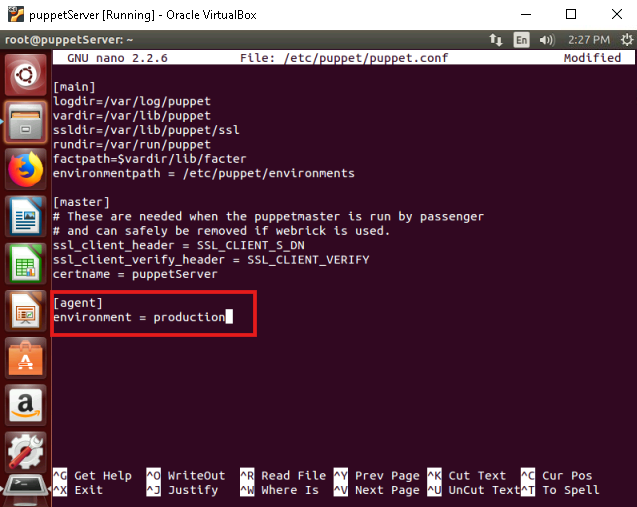

   - Note: Make sure to restart the Puppet Master after making changes to the `puppet.conf` file.

   - Alternatively, you can use the `site.pp` file on the Puppet Master to assign environments:

     ```puppet
     node 'puppetclient.example.com' {
       environment => 'development'
     }
     ```

2. **Run Puppet on the Agent**:

   Apply the environment configuration on the Puppet Agent:

   ```bash
   puppet agent -t
   ```

   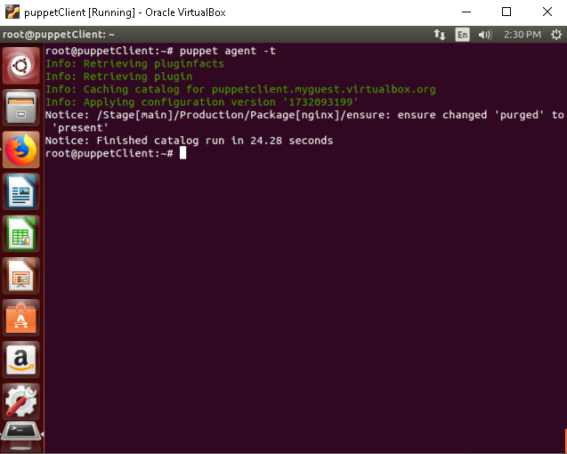

   Puppet will fetch and apply configurations from the appropriate environment (e.g., `production`, `development`).

---

### **Step 5: Manage Environments in Puppet**

1. **List Available Environments**:

   You can list available environments on the Puppet Master by checking the `environmentpath` directory:

   ```bash
   ls /etc/puppet/environments/
   ```

    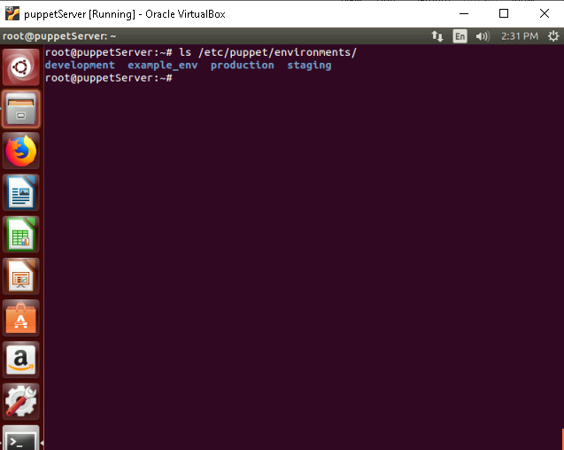

2. **Switch Environments Dynamically**:

   If you need to switch an environment for an agent dynamically, you can modify the node definition in the Puppet Master or use an ENC tool to assign the new environment.

3. **Testing Environments**:

   Verify the environment settings by checking which environment is being applied:

   ```bash
   puppet config print environment
   ```

    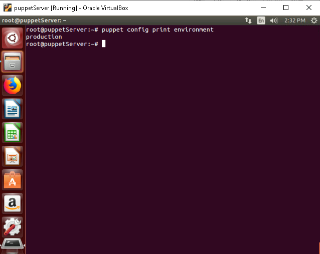

---

## **References**

- Puppet 3.8 Documentation: [Puppet Docs](https://puppet.com/docs/puppet/3.8/)
- Puppet with Multiple Environments: [Puppet Environments Best Practices](https://puppet.com/docs/puppet/latest/environments.html)

---