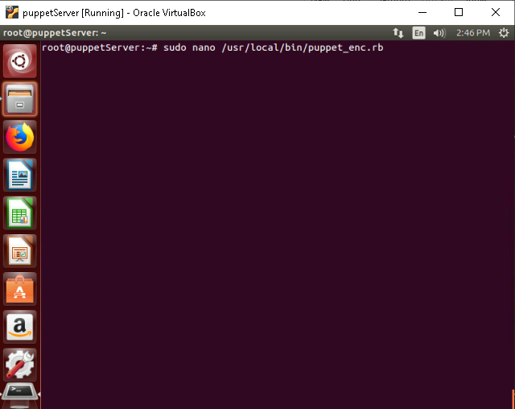
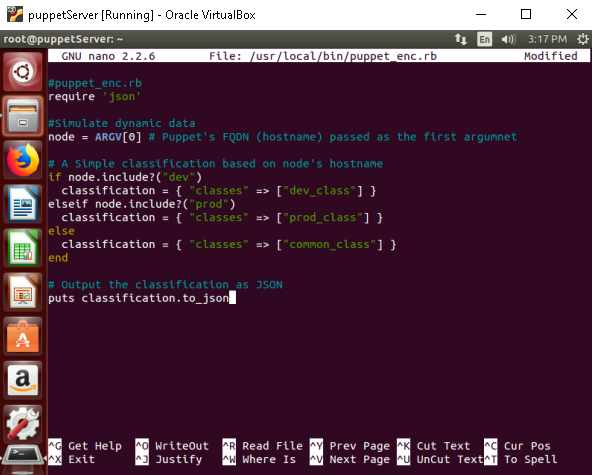
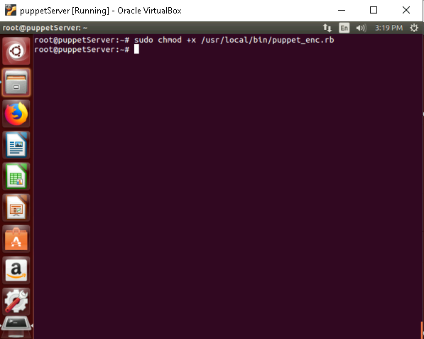
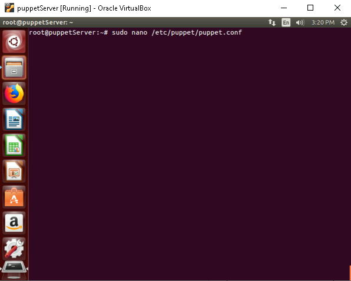
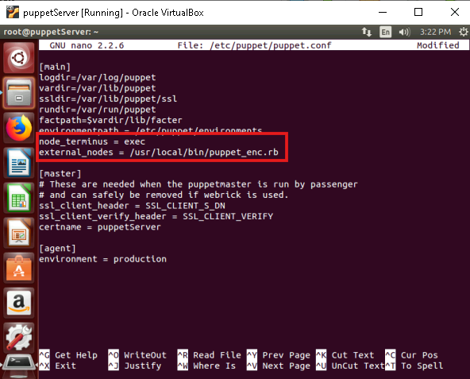
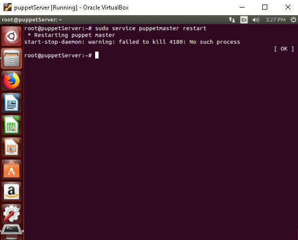
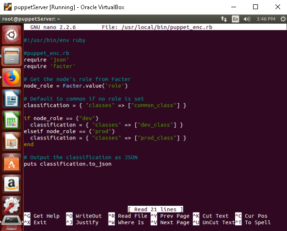
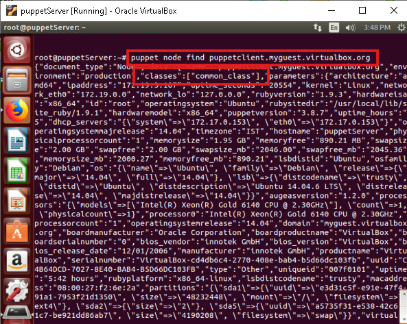

# **Automate node classification using Puppet’s external node classifier (ENC)**

## **Table of Contents**

1. [**Introduction**](#introduction)  
2. [**Problem Statement**](#problem-statement)  
3. [**Prerequisites**](#prerequisites)  
   - [**Software Requirements**](#software-requirements)  
   - [**Hardware Requirements**](#hardware-requirements)    
5. [**Implementation Steps**](#implementation-steps)  
   - [**Step 1: Set Up an External Node Classifier (ENC)**](#step-1-set-up-an-external-node-classifier-enc)  
   - [**Step 2: Configure Puppet to Use the ENC**](#step-2-configure-puppet-to-use-the-enc)  
   - [**Step 3: Write the ENC Script**](#step-3-write-the-enc-script)  
   - [**Step 4: Test the Node Classification**](#step-4-test-the-node-classification)  
6. [**References**](#references)

---

## **Introduction**

An **External Node Classifier (ENC)** is an external tool or script that integrates with Puppet to classify nodes based on their facts or other dynamic information. Instead of defining node configurations directly in `site.pp`, an ENC allows you to use external data sources (such as databases, APIs, or custom scripts) to classify nodes.

By using an ENC, you can automate the process of node classification, dynamically assign roles, environments, and other configurations based on external inputs, and ensure that your Puppet infrastructure scales efficiently.

---

## **Problem Statement**

In large-scale infrastructures with hundreds or thousands of nodes, manually classifying each node and assigning roles via `site.pp` or `puppet.conf` becomes impractical. An ENC allows for automation by dynamically classifying nodes based on their attributes, such as their hostname, IP address, or any other custom facts.

---

## **Prerequisites**
Completion of all previous lab guides (up to Lab Guide-06) is required before proceeding with Lab Guide-07.

---

### **Software Requirements**

- **Puppet Master** installed and running.
- **External Node Classifier (ENC)** script (written in Ruby, Python, or another language).
- **Puppet 3.8.7** for compatibility.
- **Node Facts** (e.g., hostname, role, environment).

---

### **Hardware Requirements**

- Puppet Master machine: Minimum 1GB RAM, 2 CPUs, and 10GB Disk.
- Puppet Agent machine(s): Minimum 512MB RAM, 1 CPU, 5GB Disk.

---

## **Implementation Steps**

### **Step 1: Set Up an External Node Classifier (ENC)**

1. **Create a Script for ENC**:

   The ENC script is a simple program that returns a JSON or YAML document describing the node’s classification. This script will query your data source (e.g., an API, a database, or a set of facts) to determine the correct classification for each node.

   Example in **Ruby** (stored in `/usr/local/bin/puppet_enc.rb`):

   ```ruby
   sudo nano /usr/local/bin/puppet_enc.rb
   ```

   

   Add the following content to the script:

   ```ruby
   #!/usr/bin/env ruby

   # puppet_enc.rb
   require 'json'

   # Simulate dynamic data
   node = ARGV[0]  # Puppet's FQDN (hostname) passed as the first argument

   # A simple classification based on node's hostname
   if node.include?("dev")
     classification = { "classes" => ["dev_class"] }
   elsif node.include?("prod")
     classification = { "classes" => ["prod_class"] }
   else
     classification = { "classes" => ["common_class"] }
   end

   # Output the classification as JSON
   puts classification.to_json
   ```

   

   This script dynamically assigns classes based on the node’s hostname. For instance, nodes with `dev` in the hostname will be assigned the `dev_class` class, and those with `prod` will be assigned `prod_class`.

2. **Make the Script Executable**:

   ```bash
   sudo chmod +x /usr/local/bin/puppet_enc.rb
   ```

   

---

### **Step 2: Configure Puppet to Use the ENC**

1. **Modify the Puppet Master Configuration**:

   Edit the `/etc/puppet/puppet.conf` file to tell Puppet to use your external node classifier script.

   Open `/etc/puppet/puppet.conf`:

   ```bash
   sudo nano /etc/puppet/puppet.conf
   ```

   

2. **Configure the External Node Classifier**:

   Add the following lines under the `[main]` section to point Puppet to the ENC script:

   ```ini
   [main]
   node_terminus = exec
   external_nodes = /usr/local/bin/puppet_enc.rb
   ```

    

   - **Explanation**:
     - `node_terminus = exec`: This tells Puppet to use an external script for node classification.
     - `external_nodes = /usr/local/bin/puppet_enc.rb`: Specifies the path to the ENC script.

3. **Restart Puppet Server**:

   Restart the Puppet Server for the changes to take effect:
   ```bash
   sudo service puppetserver restart
   ```

   

---

### **Step 3: Write the ENC Script**

If you want a more complex ENC, you can modify the script to pull node data from a database, an API, or use custom facts.

For example, you could fetch node information based on custom facts from the Puppet database or other APIs to dynamically assign roles, environments, and classes.

Here’s an enhanced version of the Ruby ENC script that checks custom facts (e.g., role or environment) for classification:

```ruby
#!/usr/bin/env ruby

#puppet_enc.rb
require 'json'
require 'facter'

# Get the node's role from Facter
node_role = Facter.value('role')

# Default to common if no role is set
classification = { "classes" => ["common_class"] }

if node_role == "dev"
  classification["classes"] = ["dev_class"]
elsif node_role == "prod"
  classification["classes"] = ["prod_class"]
end

# Output the classification as JSON
puts classification.to_json
```



- **Explanation**:

  - The script uses the **Facter** gem to retrieve the `role` fact of the node and classifies the node accordingly.

---

### **Step 4: Test the Node Classification**

1. **Verify Node Classification on the Puppet Master**:

   You can test the node classification by running the following command:

   ```bash
   puppet node find <node_fqdn>
   ```

   
   
   - Replace `<node_fqdn>` with the fully qualified domain name of the node you want to classify.
   - **Expected Output**: The `puppet node find` command should return information about the node, including the classes assigned to it (e.g., `dev_class`, `prod_class`).

---

## **References**

- [Puppet ENC Overview](https://www.puppet.com/docs/puppet/5.5/nodes_external.html)
- [Facter Documentation](https://puppet.com/docs/facter/latest/)

---