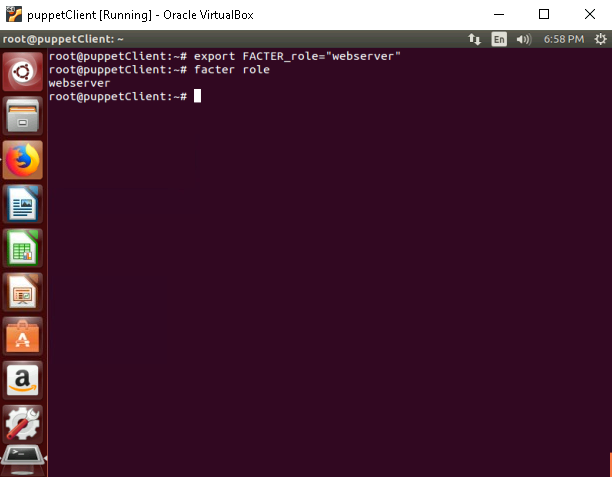

# **Write custom facts and use them in your Puppet manifests**

## **Table of Contents**

1. [**Introduction**](#introduction)  
2. [**Problem Statement**](#problem-statement)  
3. [**Prerequisites**](#prerequisites)  
   - [**Software Requirements**](#software-requirements)  
   - [**Hardware Requirements**](#hardware-requirements)   
4. [**Implementation Steps**](#implementation-steps)  
   - [**Step 1: Write a Custom Fact**](#step-1-write-a-custom-fact)  
   - [**Step 2: Verify the Custom Fact**](#step-2-verify-the-custom-fact)  
   - [**Step 3: Use the Custom Fact in a Puppet Manifest**](#step-3-use-the-custom-fact-in-a-puppet-manifest)  
   - [**Step 4: Test the Custom Fact**](#step-4-test-the-custom-fact)  
5. [**References**](#references)

---

## **Introduction**

Custom facts allow you to add node-specific data to Facter. For example, you can create a fact to indicate the role of a node (e.g., `webserver`, `database`) or custom attributes like installed software versions. This data can then be used in Puppet manifests to make configurations more dynamic and flexible.

---

## **Problem Statement**

Default facts provided by Facter (like `os`, `hostname`, and `memory`) might not cover all the data needed for node configuration. Custom facts solve this by allowing administrators to define and retrieve node-specific data that aligns with their infrastructure requirements.

---

## **Prerequisites**
Completion of all previous lab guides (up to Lab Guide-07) is required before proceeding with Lab Guide-08.

---

### **Software Requirements**

- Puppet 3.8.7
- Ruby (required for writing custom facts)

---

### **Hardware Requirements**

- Puppet Master: Minimum 1GB RAM, 2 CPUs, 10GB Disk
- Puppet Agent: Minimum 512MB RAM, 1 CPU, 5GB Disk

---

## **Implementation Steps**

### **Step 1: Write a Custom Fact**

1. **Set the Role on a Node**:

   One can manually add the facts using the export FACTER_{fact’s name} syntax to set the custom fact value for the current session on the Puppet Agent.

   ```bash
   export FACTER_role="database"
   ```

   

   > **Note**: After setting a custom fact, it is important to restart the Puppet Agent to ensure the new fact is recognized.

---

### **Step 2: Verify the Custom Fact**

1. **Verify the Custom Fact on the Puppet Agent is Set Correctly**:

  Run the following command on the Puppet Agent to verify the custom fact is set correctly on the agent to 'database'.

   ```bash
   facter role
   ```

   

   - **Expected Output**: 

    ```
    database
    ```

2. **Debugging Custom Facts**:

   If the fact does not appear, check the Facter logs for errors:

   ```bash
   facter --debug
   ```

---

### **Step 3: Use the Custom Fact in a Puppet Manifest**

1. **Write a Puppet Manifest**:

   Modify or create a manifest file to use the custom fact. For example purposes, we will use the `site.pp` manifest file located at `/etc/puppet/manifests/` on the Puppet Master.

   ```bash
   sudo nano /etc/puppet/manifests/site.pp
   ```

   

   Add the following code:

   ```puppet
   node 'puppetclient.myguest.virtualbox.org' {

     notify { "The role of this node is: ${role}": }
   
     if $role == 'database' {
       package { 'sqlite3': # SQLite package name
         ensure => installed,
       }
   
       file { '/tmp/sqlite-demo.txt': # Example of using SQLite for debugging
         ensure  => file,
         content => "SQLite has been installed successfully on this node.\n",
         require => Package['sqlite3'],
       }
     } elsif $role == 'webserver' {
       package { 'nginx':
         ensure => installed,
       }
       service { 'nginx':
         ensure    => running,
         enable    => true,
         require   => Package['nginx'],
       }
     } else {
       notify { "Role not recognized: ${role}":
         message => "No valid role found for this node.",
       }
     }
   }
   ```

   

   - **Explanation**:
        - The `notify` resource displays the role of the node.
        - The `if` statement checks the role of the node and installs the corresponding package and creates a file if the role is `database`.
        - The `elsif` statement installs the `nginx` package and starts the service if the role is `webserver`.
        - The `else` statement notifies the user if the role is not recognized.

   > **Note**: Make sure to remove ENC configurations from `/etc/puppet/puppet.conf` if you have configured them previously and even the environment configurations if you have configured them and then `restart the puppet server`.
   > 
   > 

2. **Apply the Manifest**:

   On the Puppet Agent, run the following command to apply the manifest:

   ```bash
   puppet agent -t
   ```

   

    - **Expected Output**:
    
      - The `sqlite3` package should be installed and the `/tmp/sqlite-demo.txt` file should be created if the role is `database`.
      - The `nginx` package should be installed and the `nginx` service should be running if the role is `webserver`.
      - If the role is not recognized, a notification should be displayed.

---

### **Step 4: Test the Custom Fact**

1. **Change the Node Role**:

   “export FACTER” Syntax is used to set the custom fact value for the current session.

   ```bash
   export FACTER_role="webserver"
   ```

   

2. **Run Puppet Agent**:

   Trigger the Puppet Agent to apply the updated role:

   ```bash
   puppet agent -t
   ```

   

3. **Verify Changes**:

   - Check if the package corresponding to the new role ( `nginx` for `webserver`) is installed.

---

## **References**

- [Puppet Facter Documentation](https://puppet.com/docs/facter/latest/)
- [Writing Custom Facts](https://puppet.com/docs/puppet/latest/custom_facts.html)
- [Puppet Facter Facts - Tutorialspoint](https://www.tutorialspoint.com/puppet/puppet_facter_facts.htm)

---