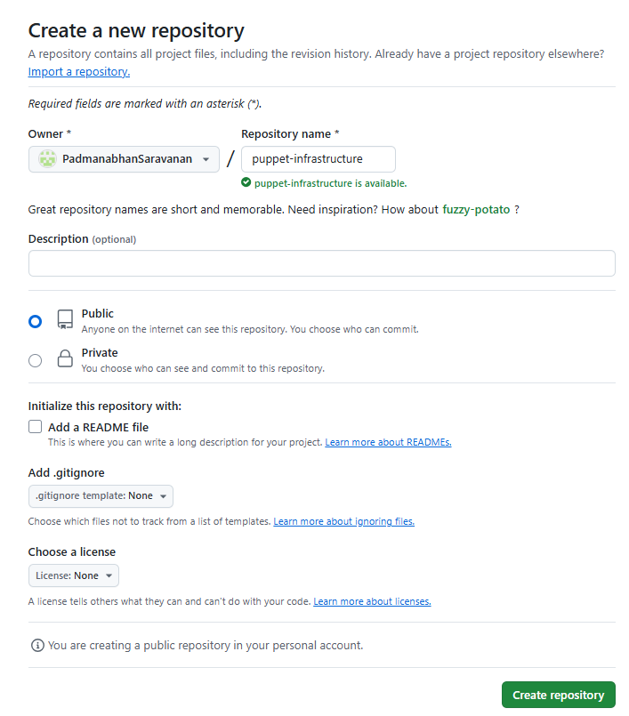

# **Integrate Puppet with version control systems like Git for infrastructure as code**


## **Table of Contents**

1. [**Introduction**](#introduction)  
2. [**Problem Statement**](#problem-statement)  
3. [**Prerequisites**](#prerequisites)  
   - [**Software Requirements**](#software-requirements)  
   - [**Hardware Requirements**](#hardware-requirements)     
4. [**Implementation Steps**](#implementation-steps)  
   - [**Step 1: Set Up Git for Puppet Code**](#step-1-set-up-git-for-puppet-code)  
   - [**Step 2: Create a Git Repository**](#step-2-create-a-git-repository)  
   - [**Step 3: Organize Puppet Code in the Repository**](#step-3-organize-puppet-code-in-the-repository)  
   - [**Step 4: Commit and Push Puppet Code**](#step-4-commit-and-push-puppet-code)  
   - [**Step 5: Automate Puppet Code Deployment with GitHub Actions**](#step-5-automate-puppet-code-deployment-with-github-actions)  
5. [**References**](#references)  

---

## **Introduction**

Integrating Puppet with **Git** for Infrastructure as Code (IaC) enables version control, collaboration, and automation of infrastructure configurations. Adding **GitHub Actions** to the workflow automates code deployment, ensuring that changes to Puppet code are automatically reflected in your infrastructure.

---

## **Problem Statement**

Manually deploying Puppet code after every change is inefficient and prone to errors. Automating the deployment process using GitHub Actions ensures that the latest Puppet code is automatically pulled and applied whenever changes are pushed to the GitHub repository.

---

## **Prerequisites**
Completion of all previous lab guides (up to Lab Guide-08) is required before proceeding with Lab Guide-09.

---

### **Software Requirements**

- Puppet 3.8.7 or higher.
- Git installed on the Puppet Master.
- A GitHub repository to store Puppet code.
- GitHub Access Token to securely push/pull code.
- GitHub Actions enabled in the repository.

---

### **Hardware Requirements**

- Puppet Master: Minimum 1GB RAM, 2 CPUs, 10GB Disk.
- Puppet Agent: Minimum 512MB RAM, 1 CPU, 5GB Disk.

---

## **Implementation Steps**

### **Step 1: Set Up Git for Puppet Code**

1. **Install Git**:

   Install Git on the Puppet Master machine:

   ```bash
   sudo apt-get install git
   ```

   

2. **Configure Git**:

   Set up your Git username and email address for commits and pushes to GitHub:

   ```bash
   git config --global user.name "Your Name"
   git config --global user.email "your.email@example.com"
   ```

---

### **Step 2: Create a Git Repository**

1. **Create a Repository on GitHub**:

   Go to [GitHub](https://github.com/) and create a new repository (e.g., `puppet-infrastructure`).

   

2. **Set Up Secure Access with a Personal Access Token**:

   - **Create an Access Token**:

     1. Go to your GitHub account **Settings**.
     2. Navigate to **Developer Settings > Personal Access Tokens > Tokens (classic)**.
     3. Click **Generate new token** and select scopes:
        - `repo` (for repository access).
        - `workflow` (to trigger workflows).
     4. Copy the token. (You will not be able to see it again.)

   - **Update Git Remote URL with Token**:

     Replace `<USERNAME>` with your GitHub username, `<ACCESS-TOKEN>` with your token, and `<REPO>` with your repository name:

     ```bash
     git remote set-url origin https://<USERNAME>:<ACCESS-TOKEN>@github.com/<USERNAME>/<REPO>.git
     ```

---

### **Step 3: Organize Puppet Code in the Repository**

1. **Directory Structure**:

   ```plaintext
   /puppet-infrastructure
     ├── manifests/
     │   └── site.pp
     ├── modules/
     │   └── nginx/
     ├── hieradata/
     └── files/
   ```

   

2. **Add Files**:

   - Add your `site.pp` to the `manifests/` directory.
   - Add your custom modules to the `modules/` directory.

---

### **Step 4: Commit and Push Puppet Code**

1. **Stage Files**:

   ```bash
   git add .
   ```

2. **Commit Changes**:

   ```bash
   git commit -m "Initial commit for Puppet infrastructure"
   ```

   

3. **Push Code to GitHub**:

   ```bash
   git push origin master
   ```

---

### **Step 5: Automate Puppet Code Deployment with GitHub Actions**

1. **Enable GitHub Actions**:

   Ensure that **Actions** are enabled in your repository settings on GitHub.

2. **Create a GitHub Workflow**:

   Add a `.github/workflows/deploy.yml` file in your repository (replace `<puppet-master-ip>` with your Puppet Master IP):

   > Note: This is a basic example. You can customize the workflow based on your requirements.

   ```yaml
   name: Deploy Puppet Code

   on:
     push:
       branches:
         - master

   jobs:
     deploy:
       runs-on: ubuntu-latest

       steps:
       - name: Checkout Repository
         uses: actions/checkout@v3

       - name: Deploy Puppet Code to Master
         env:
           PUPPET_MASTER: "<puppet-master-ip>"
           SSH_PRIVATE_KEY: ${{ secrets.SSH_PRIVATE_KEY }}
         run: |
           ssh -o StrictHostKeyChecking=no puppet@$PUPPET_MASTER "cd /etc/puppet/infrastructure && git pull origin master && puppet apply /etc/puppet/infrastructure/manifests/site.pp"
   ```

   - **Explanation**:

     - **Trigger**: This workflow triggers on every push to the `master` branch.
     - **Checkout Repository**: Checks out the latest code from the repository.
     - **Deploy Puppet Code**: Connects to the Puppet Master via SSH, pulls the latest changes, and applies the `site.pp` manifest.

3. **Add Secrets to GitHub**:

   - Navigate to **Settings > Secrets and Variables > Actions**.
   - Add the following secrets:
     - `SSH_PRIVATE_KEY`: Your private SSH key for connecting to the Puppet Master.
     - `PUPPET_MASTER`: The IP address of your Puppet Master.

4. **Test the Workflow**:

   - Push changes to the `master` branch.
   - Verify that the workflow is triggered and the latest Puppet code is applied to the Puppet Master.

---

## **References**

- [Puppet Documentation](https://puppet.com/docs/)
- [GitHub Personal Access Tokens](https://docs.github.com/en/authentication/keeping-your-account-and-data-secure/creating-a-personal-access-token)

---