# **Use Puppet Bolt for agentless execution of tasks and scripts**

## **Table of Contents**

1. [**Introduction**](#introduction)  
2. [**Problem Statement**](#problem-statement)  
3. [**Prerequisites**](#prerequisites)  
   - [**Software Requirements**](#software-requirements)  
   - [**Hardware Requirements**](#hardware-requirements)     
4. [**Implementation Steps**](#implementation-steps)  
   - [**Step 1: Install Puppet Bolt Using Puppetlabs Repository**](#step-1-install-puppet-bolt-using-puppetlabs-repository)  
   - [**Step 2: Run Ad-Hoc Commands with Bolt**](#step-2-run-ad-hoc-commands-with-bolt)  
   - [**Step 3: Execute Tasks on Remote Nodes**](#step-3-execute-tasks-on-remote-nodes)  
   - [**Step 4: Write and Execute Custom Scripts**](#step-4-write-and-execute-custom-scripts)  
   - [**Step 5: Use Plans for Complex Workflows**](#step-5-use-plans-for-complex-workflows)  
5. [**References**](#references)

---

## **Introduction**

Puppet Bolt is a versatile, agentless orchestration tool that works well in environments where Puppet agents are not installed. It uses SSH (for Linux) and WinRM (for Windows) to execute tasks and manage configurations directly on nodes.

In this guide, we’ll set up Puppet Bolt using the `puppetlabs-release-trusty.deb` package and demonstrate how to use it for task execution and workflows.

---

## **Problem Statement**

For systems without Puppet agents or for performing ad-hoc operations, managing infrastructure can become cumbersome. Puppet Bolt provides a simple way to manage such environments without requiring a full Puppet setup.

---

## **Prerequisites**
Completion of all previous lab guides (up to Lab Guide-09) is required before proceeding with Lab Guide-10.

---

### **Software Requirements**

- Ubuntu 14.04 (Trusty Tahr).
- Puppet Labs repository set up using `puppetlabs-release-trusty.deb`.
- SSH access to remote nodes for Linux systems or WinRM for Windows systems.

---

### **Hardware Requirements**

- Control Node (where Puppet Bolt will be installed): 1GB RAM, 1 CPU, 5GB Disk.
- Remote Nodes: Accessible over the network with proper credentials.

---

## **Implementation Steps**

### **Step 1: Install Puppet Bolt Using Puppet Tool Repository**

1. **Download and Install Puppet Tool Release Package**:

   If you haven’t already installed the Puppet Tool repository, do the following:

   ```bash
   wget https://apt.puppet.com/puppet-tools-release-trusty.deb
   sudo dpkg -i puppet-tools-release-trusty.deb
   ```

   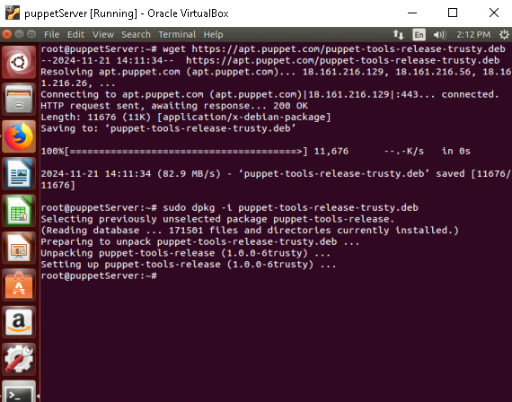

2. **Update the APT Cache**:

   ```bash
   sudo apt-get update
   ```

3. **Install Puppet Bolt**:

   ```bash
   sudo apt-get install puppet-bolt
   ```

   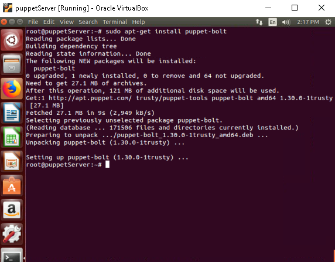

4. **Verify Installation**:

   Confirm that Bolt is installed correctly:

   ```bash
   bolt --version
   ```

   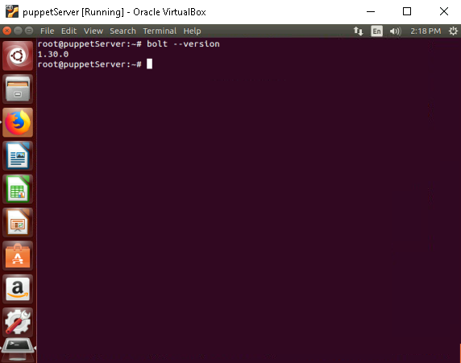

   - **Expected Output**: Displays the installed version of Bolt.

---

### **Step 2: Run Ad-Hoc Commands with Bolt**

1. **Run a Command on a Remote Node**:

   Use Bolt to execute a simple command (e.g., checking uptime) on a remote node via SSH:

   ```bash
   bolt command run 'uptime' --targets <TARGET> --user <USERNAME> --password <PASSWORD>
   ```

   Replace:
   - `<TARGET>`: IP or hostname of the target node.
   - `<USERNAME>`: Username with SSH access.
   - `<PASSWORD>`: Password for the username.

2. **Example**:

   ```bash
   bolt command run 'uptime' --targets 172.19.6.173 --user root --password password
   ```

   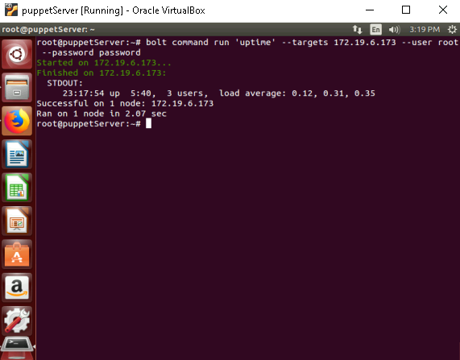

   > Note: Make sure that you have SSH access to the target node.
   >
   > if not installed, install the `openssh-server` package on the target node and enable the permitrootlogin in the /etc/ssh/sshd_config file(`permitrootlogin yes`) and restart the ssh service.

---

### **Step 3: Execute Tasks on Remote Nodes**

1. **List Available Tasks**:

   Puppet Bolt includes tasks from Puppet Forge. To list available tasks:

   ```bash
   bolt task show
   ```

   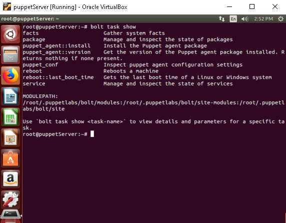

2. **Run a Predefined Task**:

   Install a package on a remote node:

   ```bash
   bolt task run package action=install name=git --targets 172.19.6.173 --user root --password password 
   ```

   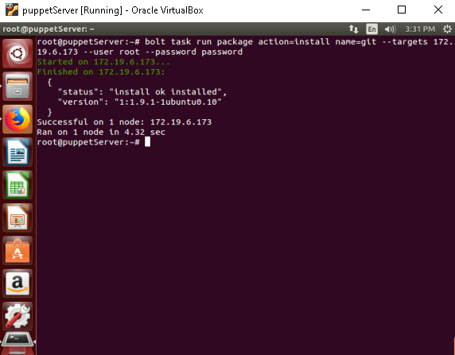

3. **Run a Task with JSON Parameters**:

   ```bash
   bolt task run package --params '{"action": "install", "name": "git"}' --targets 172.19.6.173 --user root --password password
   ```

    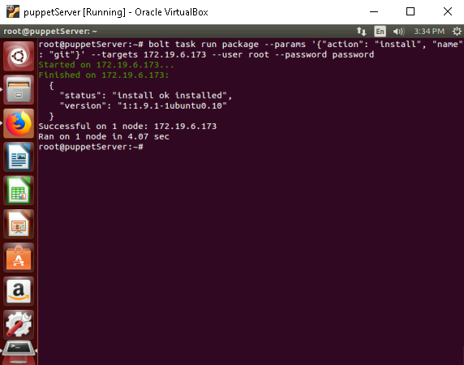

---

### **Step 4: Write and Execute Custom Scripts**

1. **Create a Script**:

   Write a custom script (e.g., `deploy_app.sh`):

   ```bash
   nano deploy_app.sh
   ```

   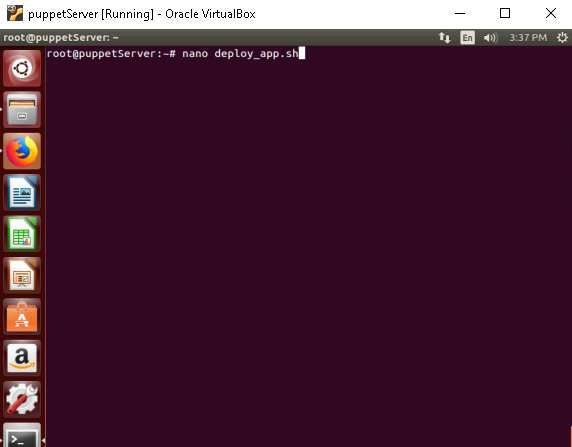 

   ```bash
   #!/bin/bash
   echo "Deploying application..."
   apt-get update
   apt-get install -y apache2
   systemctl start apache2
   systemctl enable apache2
   echo "Application deployed successfully."
   ```

   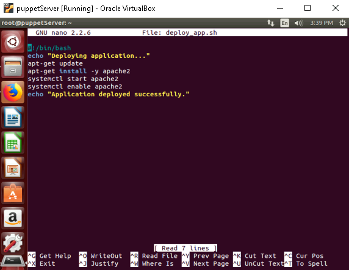

2. **Make the Script Executable**:

   ```bash
   chmod +x deploy_app.sh
   ```

   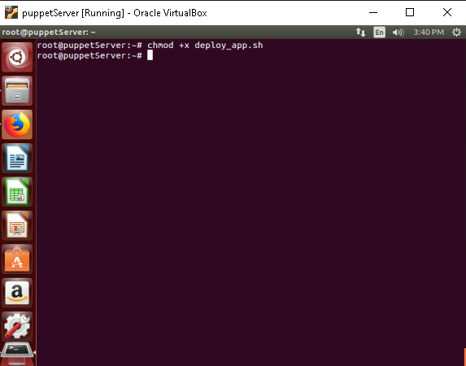

3. **Run the Script on Remote Nodes**:

   Execute the script using Bolt:

   ```bash
   bolt script run ./deploy_app.sh --targets 172.19.6.173 --user root --password password
   ```

    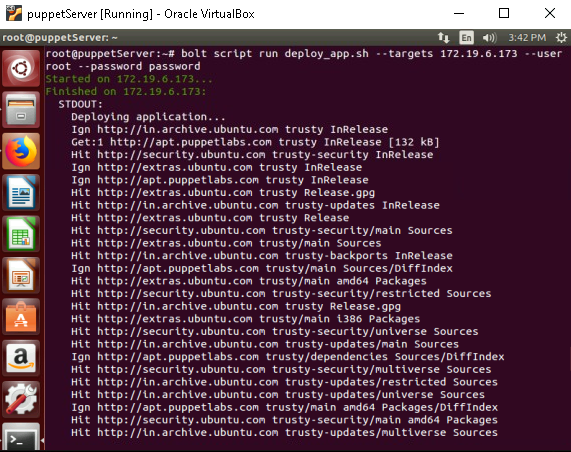

---

## **References**

- Puppet Labs Official Repository: [Puppet APT Repositories](https://apt.puppetlabs.com/)
- Puppet Bolt Documentation: [Puppet Bolt Docs](https://puppet.com/docs/bolt/latest/bolt.html)

---